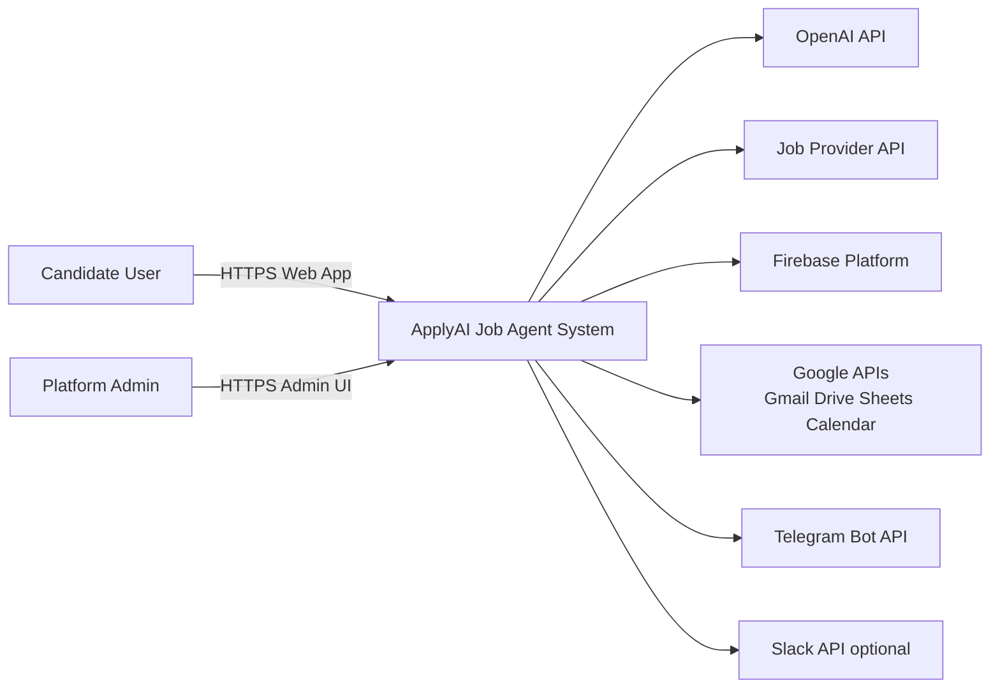
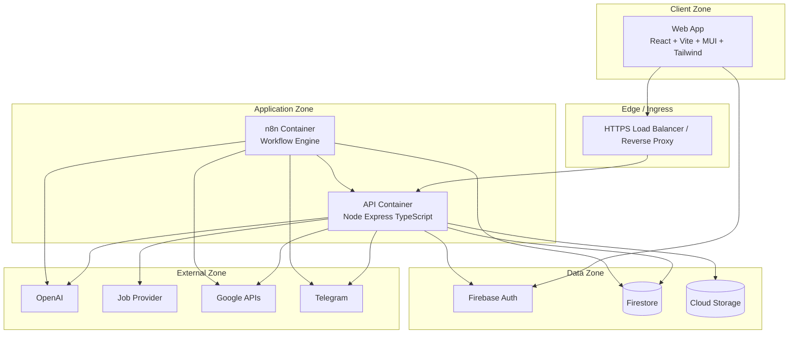

# High-Level Architecture (HLA)

**Document ID:** ARCH-HLA-V1  
**Version:** 1.0.0  

---

## 1. Purpose

Define the system at C4 **Context** and **Container** levels so all engineering roles share one mental model before low-level design and coding.

---

## 2. System context (C4 Level 1)

### Explanation

| Actor / System | Role |
|----------------|------|
| Candidate | Primary user: profile, jobs, AI tools, tracking |
| Admin | Prompt governance, users, audit, feature flags |
| ApplyAI | Our product boundary (web + API + workflows) |
| OpenAI | LLM inference for generation/analysis |
| Job Provider API | Aggregated listings (e.g., JSearch) — no HTML scraping |
| Firebase | Auth, Firestore, Storage |
| Google APIs | Optional email/storage/tracking/calendar |
| Telegram / Slack | Optional notification channels |

**Trust boundary:** Everything inside ApplyAI is under our SDLC. External systems are untrusted dependencies; failures must degrade gracefully.

---

## 3. Container architecture (C4 Level 2)

### Container responsibilities

| Container | Responsibility | Scaling unit |
|-----------|----------------|--------------|
| Web App | Presentation, UX state, calls API with Firebase ID token | CDN / static hosting |
| API | Business rules, authz, AI orchestration, persistence | Horizontal containers |
| n8n | Scheduled digests, fan-out notifications, sheet sync | Single/HA worker |
| Firebase Auth | Identity proofing | Managed |
| Firestore | System of record for domain documents | Managed |
| Storage | Resume binaries | Managed |

---

## 4. Logical domains (bounded contexts)

| Context | Owns | Key aggregates |
|---------|------|----------------|
| Identity & Access | Auth, roles, sessions | User, Role |
| Candidate Profile | Profile, resumes, ATS | Profile, Resume |
| Opportunity | Jobs, matching, saves | Job, MatchScore |
| Application Pipeline | Apply, statuses, interviews, offers | Application, Interview, Offer |
| AI Content | Prompts, generations, chat | PromptVersion, Generation |
| Engagement | Notifications, digests | Notification, Preference |
| Governance | Admin, audit, settings | AuditLog, Setting |

Contexts communicate via API use-cases or domain events (notification/analytics), not by reaching into foreign repositories.

---

## 5. Cross-cutting concerns

| Concern | HLA decision |
|---------|--------------|
| Security | Zero trust between client and API; verify every token; RBAC |
| Observability | Request IDs, structured logs, error budgets |
| Cost control | AI/job API quotas per user + global circuit breakers |
| Compliance | Assistive apply; user confirmation; no credential stuffing |
| Config | 12-factor env vars; secret manager in prod |

---

## 6. Why this HLA

1. Separates UI from business rules (testable API).  
2. Keeps secrets off the client.  
3. Allows n8n to automate without embedding cron logic in API.  
4. Uses managed Firebase for auth/data to reduce ops load.  
5. Isolates external AI/job providers behind the API service layer.
