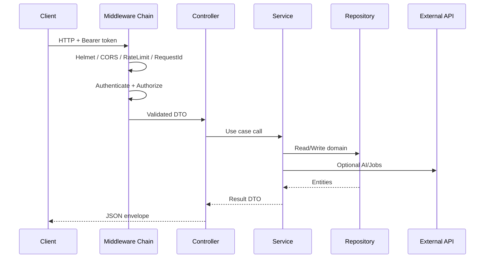

# Low-Level Architecture (LLA)

**Document ID:** ARCH-LLA-V1  
**Version:** 1.0.0  

---

## 1. Backend layering (Clean Architecture)

```
backend/src/
├── presentation/          # Controllers, Routes, Swagger annotations
├── application/           # Use-cases / Services, DTOs, interfaces (ports)
├── domain/                # Entities, value objects, domain errors
├── infrastructure/        # Firebase, OpenAI, JobProvider, n8n webhooks
├── middleware/            # Auth, validation, rate limit, error, requestId
└── config/                # Env, logger, DI container composition root
```

### Dependency rule

```
presentation → application → domain
       │              │
       └──── infrastructure implements application ports ────┘
```

- Controllers depend on **service interfaces**, not Firebase SDKs.  
- Repositories implement ports defined in application/domain.  
- Composition root (`config/container.ts`) wires implementations (DI).

### Target package mapping (production layout)

| Layer | Responsibility | Examples |
|-------|----------------|----------|
| Controllers | HTTP in/out, status codes | `AuthController` |
| Routes | Path mounting | `/api/v1/jobs` |
| Middleware | Cross-cutting | `authenticate`, `validateBody` |
| Services (Application) | Orchestration / use cases | `SmartApplyService` |
| Repositories | Persistence ports + adapters | `FirestoreUserRepository` |
| Models / Domain | Entities | `Application`, `Resume` |
| Validators | Zod schemas | `createApplicationSchema` |
| DTOs | Request/response contracts | `JobResponseDto` |
| Utils | Pure helpers | `detectJobSource` |
| Config | Env + DI | `env.ts`, `container.ts` |

---

## 2. Frontend layering (Clean + Feature-based)

```
frontend/src/
├── app/                   # Router, store provider, theme provider
├── features/<feature>/    # Vertical slices
│   ├── presentation/      # Pages, components
│   ├── application/       # Hooks, thunks/queries
│   ├── domain/            # Types, pure mappers
│   └── infrastructure/    # API adapters for the feature (optional)
└── shared/
    ├── presentation/      # Design system components
    ├── application/       # Shared hooks
    ├── domain/            # Shared types
    └── infrastructure/    # Axios client, Firebase SDK
```

### State strategy (target)

| Concern | Tool | Why |
|---------|------|-----|
| Client/global UI state | Redux Toolkit | Predictable, enterprise tooling, DevTools |
| Server cache | React Query | Caching, retries, stale-while-revalidate |
| Forms | React Hook Form + Zod | Performance + schema sharing with API |
| Routing | React Router | Standard SPA routing |

> **Debt note:** Current scaffold uses Zustand. Phase 4–5 migrates to Redux Toolkit + React Query per stack mandate.

---

## 3. Request lifecycle (API)



### Standard response envelope

```json
{
  "success": true,
  "data": {},
  "meta": { "requestId": "uuid", "timestamp": "ISO-8601" }
}
```

Error envelope:

```json
{
  "success": false,
  "error": { "code": "VALIDATION_ERROR", "message": "...", "details": {} },
  "meta": { "requestId": "uuid" }
}
```

---

## 4. Dependency Injection approach

**Pattern:** Constructor injection via a lightweight composition root (no heavy IoC framework required for Node scale).

```typescript
// Conceptual — implemented in Phase 6 hardening
export interface AppContainer {
  userRepository: IUserRepository;
  applicationRepository: IApplicationRepository;
  jobProvider: IJobProvider;
  aiClient: IAiClient;
  smartApplyService: SmartApplyService;
}
```

Benefits:

- Services testable with fakes  
- Swap memory ↔ Firestore without controller changes  
- Clear ownership of lifetimes (request-scoped vs singleton)

---

## 5. AuthN / AuthZ low-level design

1. Client signs in with **Firebase Auth** (email/password, Google).  
2. Client sends `Authorization: Bearer <Firebase ID Token>`.  
3. API verifies token with Firebase Admin SDK.  
4. Custom claims carry `role: user | admin`.  
5. Optional session JWT bridge only if required for non-Firebase clients (documented ADR in Phase 3).  
6. Resource ownership checks in services (`application.userId === auth.uid`).

---

## 6. AI orchestration low-level design

```
Controller → AiGenerationService
  → PromptRepository.getActive(name)
  → AiClient.complete(prompt, vars)
  → GenerationRepository.save(result, promptVersion)
  → QuotaService.consume(userId)
```

Rules:

- Prompts are versioned and immutable once published  
- Outputs labeled AI-assisted  
- Quotas enforced before provider call  

---

## 7. Compliance control points

| Control | Where enforced |
|---------|----------------|
| User confirmation for Smart Apply | Frontend dialog + API `confirmed: true` |
| No auto-submit to third parties | Service only returns `applyUrl`; never posts to employer forms |
| Outreach rate limits | Middleware + QuotaService |
| PII minimization | DTO mappers strip unused fields in logs |

---

## 8. Error & logging strategy

- Domain errors → typed `AppError` with stable codes  
- Unexpected errors → logged with stack + requestId; generic client message  
- Winston JSON logs in production  
- Never log tokens, resume binary contents, or full prompt secrets  
