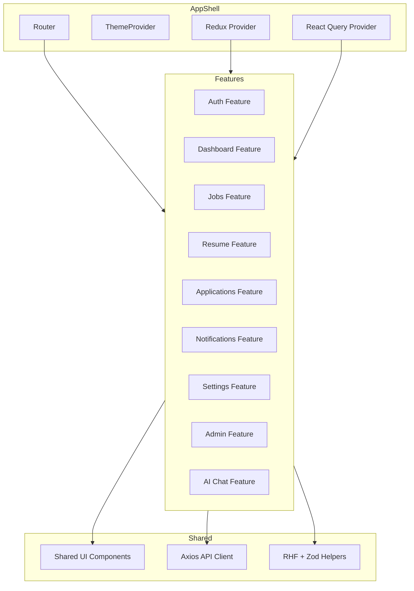

# Component Diagram

**Document ID:** ARCH-COMP-V1  
**Version:** 1.0.0  

---

## 1. Backend components

```mermaid
flowchart TB
  subgraph Presentation
    Routes
    Controllers
    Swagger
  end

  subgraph Middleware
    AuthMW[Auth Middleware]
    ValidMW[Validation Middleware]
    RateMW[Rate Limit Middleware]
    ErrMW[Error Middleware]
  end

  subgraph Application
    ProfileSvc[Profile Service]
    JobSvc[Job Service]
    MatchSvc[Matching Service]
    ApplySvc[Smart Apply Service]
    AppTrackSvc[Application Tracker Service]
    AiSvc[AI Generation Service]
    NotifSvc[Notification Service]
    AdminSvc[Admin / Prompt Service]
    AuditSvc[Audit Service]
  end

  subgraph Ports
    IUserRepo[IUserRepository]
    IJobRepo[IJobRepository]
    IAppRepo[IApplicationRepository]
    IResumeRepo[IResumeRepository]
    IPromptRepo[IPromptRepository]
    INotifRepo[INotificationRepository]
    IJobProvider[IJobProvider]
    IAiClient[IAiClient]
    IMailer[IMailer]
    IMessenger[IMessenger]
  end

  subgraph Adapters
    FSUser[Firestore User Repo]
    FSApp[Firestore Application Repo]
    FSResume[Firestore Resume Repo]
    JSearch[JSearch Adapter]
    OpenAIAd[OpenAI Adapter]
    SendGrid[Email Adapter]
    TelegramAd[Telegram Adapter]
    StorageAd[Firebase Storage Adapter]
  end

  Routes --> AuthMW --> Controllers
  Controllers --> ValidMW
  Controllers --> ProfileSvc & JobSvc & ApplySvc & AiSvc & AppTrackSvc & NotifSvc & AdminSvc
  ProfileSvc --> IUserRepo
  JobSvc --> IJobProvider
  JobSvc --> MatchSvc
  ApplySvc --> IAppRepo
  AiSvc --> IPromptRepo & IAiClient
  NotifSvc --> INotifRepo & IMailer & IMessenger
  AuditSvc --> Controllers

  IUserRepo -.-> FSUser
  IAppRepo -.-> FSApp
  IResumeRepo -.-> FSResume
  IJobProvider -.-> JSearch
  IAiClient -.-> OpenAIAd
  IMailer -.-> SendGrid
  IMessenger -.-> TelegramAd
```

### Explanation

- **Presentation** is thin: HTTP concerns only.  
- **Application services** orchestrate use cases and enforce business rules.  
- **Ports** are interfaces (DIP).  
- **Adapters** are replaceable infrastructure (Firestore, OpenAI, Telegram).  
- Middleware forms a security/validation ring around controllers.

---

## 2. Frontend components

### Explanation

Each feature owns its pages and feature-local components. Shared UIKit prevents visual drift. Server state lives in React Query; auth/session/theme preferences live in Redux Toolkit.

---

## 3. Automation components (n8n)

| Component | Role |
|-----------|------|
| Schedule Trigger | Cron for digests / refresh |
| HTTP Request | Calls ApplyAI API with service credentials |
| OpenAI Node | Optional direct AI steps when approved |
| Gmail / Sheets / Drive / Telegram nodes | Channel integrations |
| IF / Merge / Loop | Branching and batching |
| Error Workflow | Centralized failure handling + alerts |

n8n is **outside** the API process but inside the same Docker Compose network for private calls.
