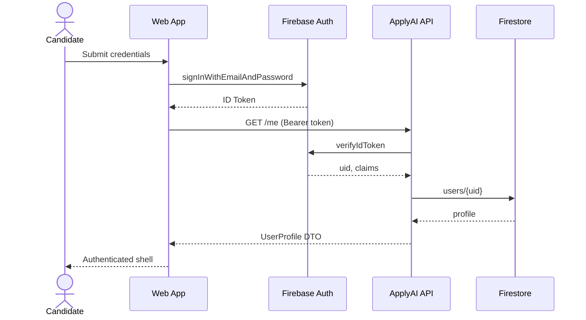
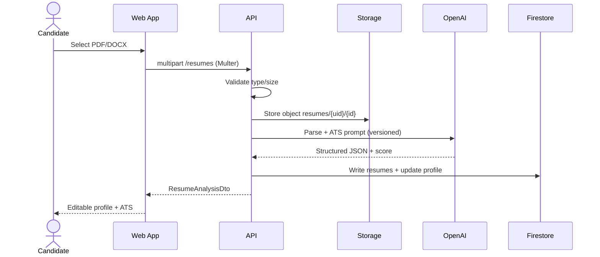
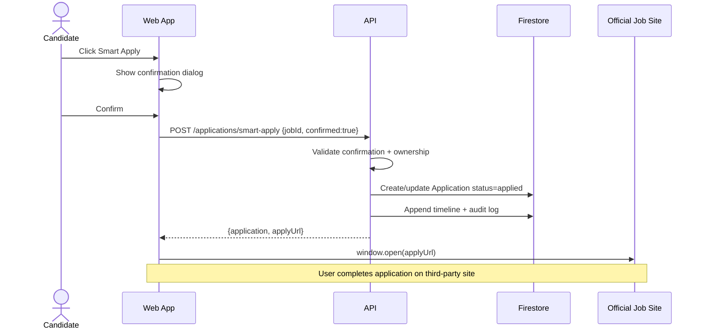
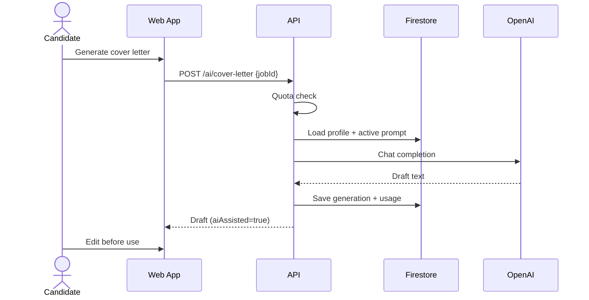
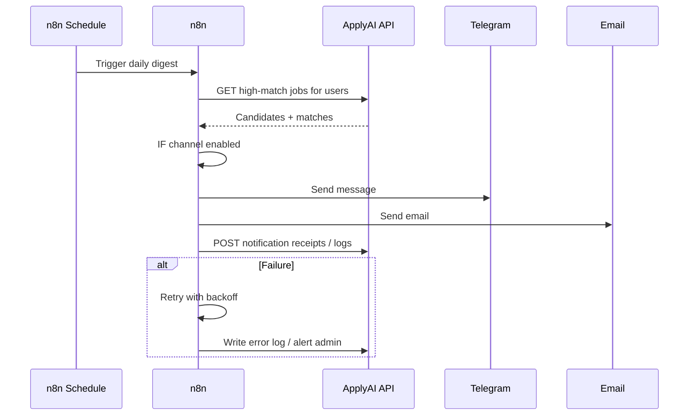

# Sequence Diagrams

**Document ID:** ARCH-SEQ-V1  
**Version:** 1.0.0  

---

## SEQ-01 — Authentication (Firebase)

**Explanation:** Identity is owned by Firebase Auth. The API never stores passwords. Authorization uses verified claims + resource ownership.

---

## SEQ-02 — Resume upload & analysis

**Explanation:** Parsing is server-side so OpenAI keys never reach the browser. Prompt version is persisted with the generation for auditability.

---

## SEQ-03 — Smart Apply (compliance-critical)

**Explanation:** The system records intent and opens the official URL. It does **not** submit employer forms. Both UI confirmation and API `confirmed` flag are required.

---

## SEQ-04 — Cover letter generation

---

## SEQ-05 — Notification fan-out (n8n digest)

**Explanation:** Digests are automation-owned. API remains source of truth for preferences and match data. Retries and error workflow are mandatory for production workflows.
