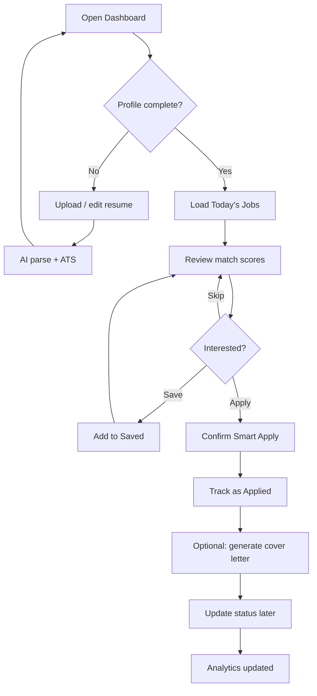
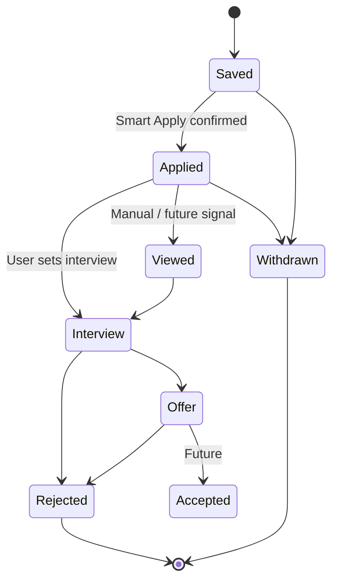
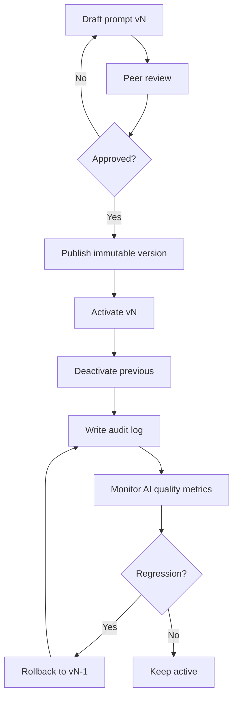

# Activity Diagrams

**Document ID:** ARCH-ACT-V1  
**Version:** 1.0.0  

---

## ACT-01 — Candidate daily job loop

**Explanation:** Optimizes for a repeatable daily habit: completeness → discovery → decision → compliant apply → tracking.

---

## ACT-02 — Application pipeline lifecycle

**Explanation:** Status transitions are explicit and audited. Interviews and offers are first-class later collections linked to an Application.

---

## ACT-03 — Admin prompt release

**Explanation:** Prompt changes are treated like code releases: version, activate, rollback, audit.
