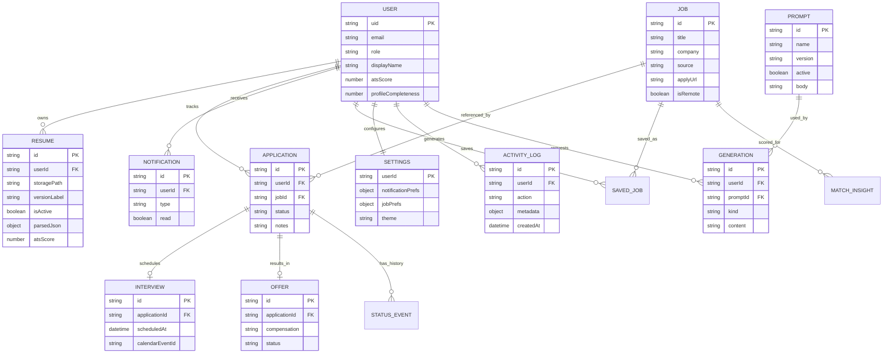

# ER Diagram & Database Diagram

**Document ID:** ARCH-DATA-V1  
**Version:** 1.0.0  

> Physical Firestore collection design is finalized in Phase 7. This Phase 2 model locks **logical entities and relationships**.

---

## 1. Entity-Relationship (logical)

### Explanation

- **USER** is the ownership root for almost all candidate data.  
- **JOB** may be cached/normalized; applications store denormalized title/company for history stability if the cache expires.  
- **INTERVIEW** / **OFFER** hang off **APPLICATION** so pipeline analytics stay consistent.  
- **PROMPT** / **GENERATION** enable AI governance and reproducibility.  
- **ACTIVITY_LOG** supports security audit and admin investigation.

---

## 2. Database diagram (Firestore physical preview)

| Collection | Doc ID strategy | Notes |
|------------|-----------------|-------|
| `users` | Firebase `uid` | Profile + role summary |
| `resumes` | Auto ID | `userId` field + composite index |
| `jobs` / `jobCache` | Provider job id | TTL via `expiresAt` |
| `savedJobs` | `{userId}_{jobId}` | Fast membership checks |
| `applications` | Auto ID | Status + timeline array or subcollection |
| `interviews` | Auto ID | Linked `applicationId` |
| `offers` | Auto ID | Linked `applicationId` |
| `notifications` | Auto ID | Per-user queries `where userId ==` |
| `prompts` | `{name}_{version}` | One `active=true` per name |
| `generations` | Auto ID | AI outputs |
| `settings` | `uid` | 1:1 with user |
| `activityLogs` | Auto ID | Append-only |
| `analyticsDaily` | `{uid}_{yyyy-mm-dd}` | Pre-aggregates |

### Relationship enforcement

Firestore has no native FK constraints. Enforcement is in the **service layer** + **security rules**:

- Writes only under authenticated `uid`  
- Admin collections require `role == admin`  
- Append-only logs deny client updates/deletes  

---

## 3. Index plan (preview)

| Query | Index fields |
|-------|--------------|
| Applications by user + status | `userId ASC`, `status ASC`, `updatedAt DESC` |
| Notifications unread | `userId ASC`, `read ASC`, `createdAt DESC` |
| Resumes by user | `userId ASC`, `createdAt DESC` |
| Active prompt by name | `name ASC`, `active ASC` |

Detailed rules/indexes ship in Phase 7 (`DATABASE.md`, `firebase/`).
