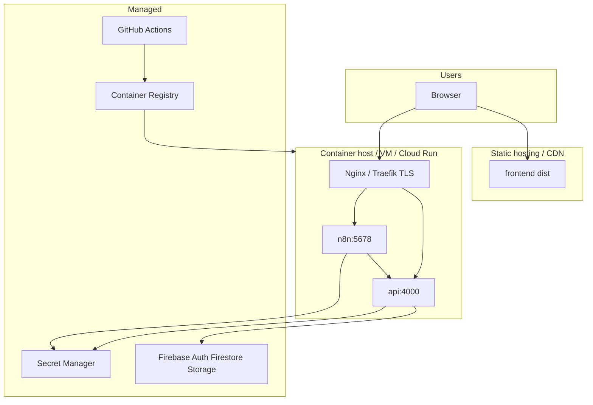
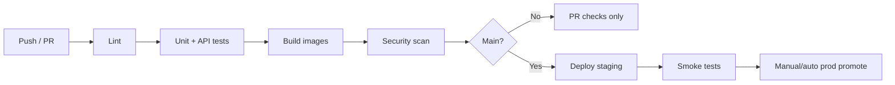

# Deployment Diagram

**Document ID:** ARCH-DEP-V1  
**Version:** 1.0.0  

---

## 1. Environments

| Environment | Purpose | Data |
|-------------|---------|------|
| Local | Developer machines | Demo/memory or dedicated Firebase dev project |
| Staging | Pre-prod validation | Staging Firebase + limited OpenAI |
| Production | Paying users | Production Firebase + secret manager |

---

## 2. Deployment topology

### Explanation

- **Frontend** is a static SPA behind CDN.  
- **API** and **n8n** run as containers; only API is public (n8n admin locked down).  
- **Secrets** injected at runtime; never baked into images.  
- **CI** builds, tests, scans, and publishes images.

---

## 3. Docker Compose (logical services)

| Service | Image role | Ports |
|---------|------------|-------|
| `frontend` | Nginx serving SPA | 80/443 |
| `backend` | Node API | 4000 |
| `n8n` | Workflow engine | 5678 (private) |
| `proxy` optional | TLS termination | 443 |

Compose file evolves in Phase 4/14 to match this diagram exactly (current `docker/` is bootstrap).

---

## 4. CI/CD pipeline (target)

---

## 5. Scaling & recovery

| Concern | Strategy |
|---------|----------|
| API scale-out | Stateless replicas behind LB |
| Firestore scale | Managed; design for indexed queries |
| n8n | Vertical + queue mode later if needed |
| Backups | Firestore export schedule; Storage versioning |
| RPO / RTO | Align with NFR: RPO ≤ 24h, RTO ≤ 4h |
| Rollback | Previous container image + prompt rollback |

---

## 6. Security zones

1. **Public:** SPA + API HTTPS endpoints  
2. **Private:** n8n UI, admin metrics, internal webhooks  
3. **Managed:** Firebase / OpenAI / Google — accessed with least-privilege keys  
