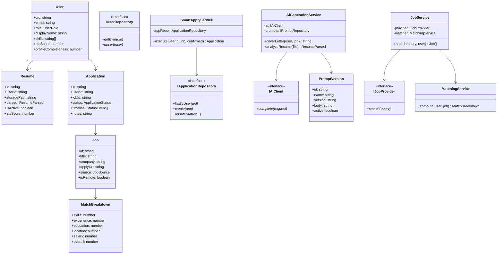

# Class Diagram (Core Domain & Application)

**Document ID:** ARCH-CLASS-V1  
**Version:** 1.0.0  

---

## 1. Domain + application classes

### Explanation

- Domain types are persistence-agnostic.  
- Services depend on **interfaces**, not Firestore/OpenAI classes (DIP).  
- `SmartApplyService` encapsulates compliance rule: `confirmed` must be true.  
- `MatchingService` is pure/deterministic for unit testing without I/O.

---

## 2. DTO vs Domain rule

| Type | Lives in | Mutable by client? |
|------|----------|--------------------|
| Request DTO | application/dto | Validated input only |
| Domain entity | domain | Service-controlled |
| Response DTO | application/dto | Mapped outward |

Controllers never return raw infrastructure documents.
